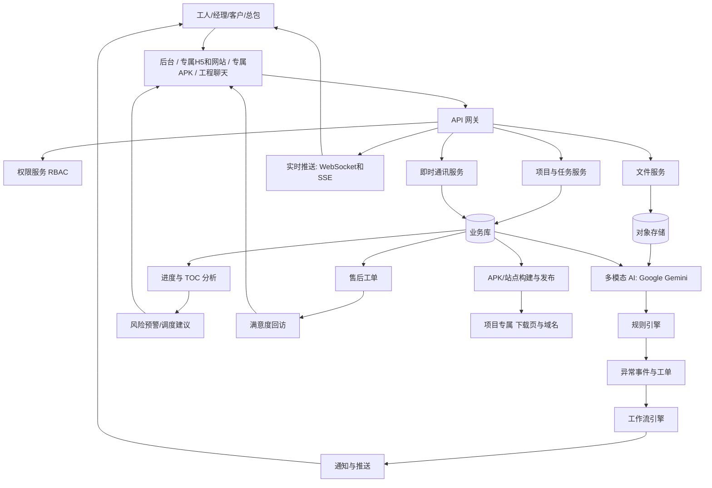

# AI 施工管理系统 - 数据流程图（DFD）

## 1. 端到端数据流程说明
1. 多端用户（工人/经理/客户/总包）经 **管理后台、专属 H5/网站、专属 APK、小程序** 上传图纸、照片、视频与任务信息，并在 **工程聊天** 中收发信息。
2. 网关层完成鉴权、限流、审计并将数据分发到业务服务。
3. 影像数据进入对象存储，元数据写入业务数据库；聊天消息入消息库。
4. **AI 服务仅调用 谷歌多模态大模型（Google Gemini）** 异步对影像/图文进行理解、比对、分类，输出结构化结果。
5. 规则引擎结合工序标准、材料标准进行异常判定并生成事件。
6. 工作流引擎接收事件创建任务或整改工单，**实时通道（WebSocket/SSE）+ 消息推送** 通知相关角色；进度聚合写回，**客户侧网站/APK 近实时展示**。
7. 进度与 TOC 分析服务聚合任务与材料数据，输出瓶颈和延期预警。
8. 专属 **APK 与网站** 从同一 API 拉取项目维度数据，保证「一处更新、处处可见」。

## 2. Mermaid 流程图

## 3. 数据对象清单
- 主数据：项目、空间点位、工序标准、材料标准、角色权限
- 业务数据：任务、问题单、验收单、售后工单、评论
- 媒体数据：图纸、照片、视频、**Gemini 结构化输出/摘要**
- 实时与社交：**聊天消息、已读、频道、@关联业务 ID**
- 交付物：**APK 制品、站点配置、短链/下载令**
- 分析数据：进度偏差、瓶颈指数、延期风险分数、满意度指标
